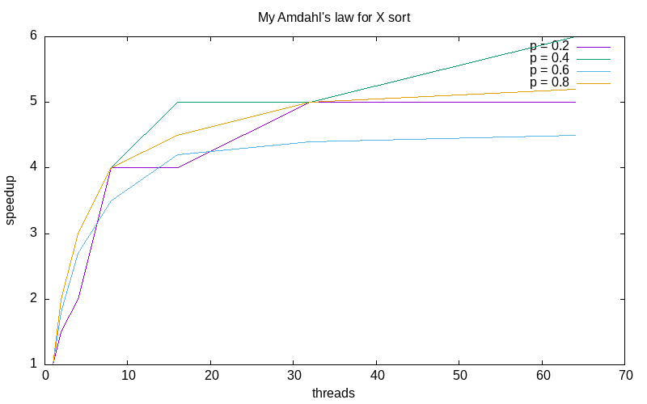
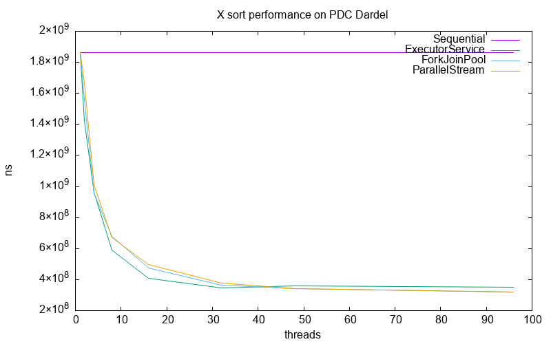

# Lab 2 - Java Parallel Programming and Sorting Algorithms
- Group 6
- Dussud, Simon and Wang, Carl

## Task 1: Sequential Sort
We chose to implement MergeSort, the implementation is taken from the website GeeksForGeeks, considering the sequential sort implementation is only a small part in this lab and was already taught in previous courses. The link is: https://www.geeksforgeeks.org/merge-sort/

Source files:

- `SequentialSort.java`

## Task 2: Amdahl's Law

In this section, we will estimate, based on Amdahl’s law, the theoretical speedup obtained for a multi-threaded merge sort algorithm. To do this, we need to make a few assumptions: 
-   For an array of size n, the number of comparisons needed to sort the array is n*log(n).
- At each step, the array is divided into two equal parts.

#### For s=2 threads
Let’s start with 2 threads to understand the reasoning and be able to generalize it for s threads. First, we need to partition the array into two equal parts. Thus, the lower and upper half can be sorted independently by threads 1 and 2. The merging of the two is sequential work that takes time n.

So for two threads, we have the following:

\[
p = \frac{2 \cdot \frac{n}{2}  \log_2\left(\frac{n}{2}\right)}{n + 2 \cdot \frac{n}{2}  \log_2\left(\frac{n}{2}\right)} = \frac{\log_2\left(\frac{n}{2}\right)}{1 + \log_2\left(\frac{n}{2}\right)},
\]

\[
1-p = \frac{n}{n + 2 \cdot \frac{n}{2}  \log_2\left(\frac{n}{2}\right)} = \frac{1}{1 + \log_2\left(\frac{n}{2}\right)},
\]

\[
S_{2,n} = \frac{1}{1-p+ \frac{p}{2}} = \frac{1}{\frac{1}{1 + \log_2\left(\frac{n}{2}\right)}+\frac{\log_2\left(\frac{n}{2}\right)}{2\left( 1 + \log_2\left(\frac{n}{2}\right) \right) }}
\]

\[
\textcolor{red}{\underline{ \textcolor{black}{S_{2,n}  = \frac{2 + 2\log_2\left(\frac{n}{2}\right)}{2 + \log_2\left(\frac{n}{2}\right)}}}
}
\]

#### For s threads

Let’s assume first that there exists $p$ such that $s = 2^p$ to simplify the reasoning. For a larger number of threads s, we only achieve full parallelism after sufficient partitioning (tree depth of $\log_2 (s)$). Once this parallelism is reached, each thread can sort its array in $\frac{n}{s}\log_2\left(\frac{n}{s}\right)$. Then, the merging steps are parallelized for i ranging from $\log_2 (s)-1$ to $0$ , with the number of threads decreasing from $\frac{log_2(s)}{2}$ to 1.

So for s threads, we have the following:

\[
\forall i \in [0, \log_2(s) - 1], \, p_i =\frac{n}{n\log_2\left(s\right)+n\log_2\left(\frac{n}{s}\right)}=\frac{1}{\log_2\left(s\right)+\log_2\left(\frac{n}{s}\right)},
\]
\[
\text{For } i = \log_2(s), \, p_i =\frac{n\log_2\left(\frac{n}{s}\right)}{n\log_2\left(s\right)+n\log_2\left(\frac{n}{s}\right)}=\frac{\log_2\left(\frac{n}{s}\right)}{\log_2\left(s\right)+\log_2\left(\frac{n}{s}\right)}
\]
\[
S_{s,n} =\frac{1}{\left( \sum_{0}^{\log_2(s)-1}\frac{\left( {\frac{1}{2}} \right)^i}{\log_2\left(s\right)+\log_2\left(\frac{n}{s}\right)} \right)+\frac{\frac{1}{s}\log_2\left(\frac{n}{s}\right)}{\log_2\left(s\right)+\log_2\left(\frac{n}{s}\right)}},
\]
\[
\textcolor{red}{\underline{ \textcolor{black}{S_{s,n} =\frac{\log_2\left(s\right)+\log_2\left(\frac{n}{s}\right)}{2-\left( \frac{1}{2} \right)^{\log_2\left( s \right)-1}+\frac{1}{s}\log_2\left(\frac{n}{s}\right)}}}}
\]
To answer the question, here is  Amdahl's law for the merge sort algorithm with 4, 8, and 16 threads respectively (according to the precedence formula),

\[
S_{4,n} =\frac{8+4\log_2\left(\frac{n}{4}\right)}{6+\log_2\left(\frac{n}{4}\right)}
\]
\[
S_{8,n} = ...
\]
\[
S_{16,n} = ...
\]

We see that ...

## Task 3: ExecutorServiceSort
Due to the reason that Java's executor service can not easily manage recursive calls. Our solution is to divide the sub tasks before calling the workers. Using the method splitArray(), an arraylist containing evenly-distributed subarrays' indexes in the unsorted array will be returned(based on the number of threads). This is further used to call workers to sort subarrays concurrently. After terminating the executor, the unsorted array is modified into an array with X(number of threads) sorted subrrays. In the end these subarrays will be merged one by one.

Source files:

- `ExecutorServiceSort.java`

## Task 4: ForkJoinPoolSort
ForkJoinPool() is the currently standard for such tasks that are meant to be broken into smaller pieces recursively. The implementation is pretty clear, the functionality of parallel sorting is simply achieved by distribute currently sorting subarrays into 2 pieces and submit the tasks of processing these 2 subarrays to the pool and the pool will use/re-use a thread to do the job. 

Source files:

- `ForkJoinPoolSort.java`

## Task 5: ParallelStreamSort
This task was a bit tricky and took some time for us to think about. Our solution is, like ExecutorServiceSort, make the indexes as parallel streams, each pair of the indexes, say (l, m) and (m+1, r), will be used to call merge sort concurrently. 

Source files:

- `ParallelStreamlSort.java`

## Task 6: Performance measurements with PDC

We decided to sort 10,000,000 integers ...

We see that ...
